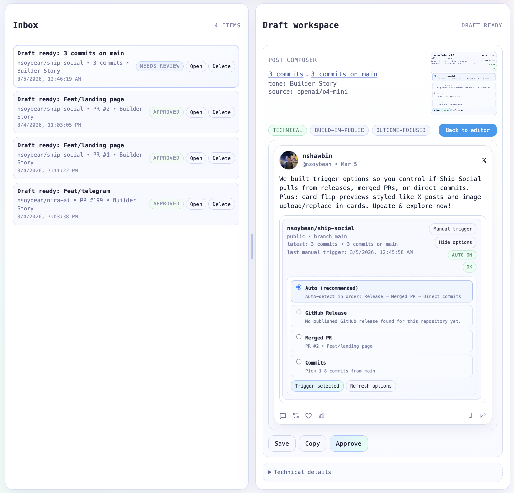

# Ship Social

<!-- image from public -->




Turn GitHub release signals into social-ready drafts for indie hackers.

Core loop: **Ship feature -> check inbox -> approve draft -> publish**

## What The App Does

- Connects your GitHub account
- Lets you connect repos in **Repo Manager**
- Uses manual trigger (and release signal fallback) to generate post drafts
- Creates 3 angle variants (`technical`, `build-in-public`, `outcome-focused`)
- Generates a release visual
- Lets you edit/copy/approve in Draft workspace
- Shows technical release context (PR/files/commits) in expandable details

## Where Things Happen In UI

- **Top bar**
  - `Repos` -> opens Repo Manager (connect repos + manual trigger)
  - `Tone` -> opens Tone Profile dialog
- **Inbox**
  - Incoming draft-ready events
- **Draft workspace**
  - Composer, X preview, editable content, approve/save/copy
- **Tone dialog**
  - Method 1: select existing tone
  - Method 2: create custom tone
  - Optional helper: extract tone from pasted posts (3-5 examples) to prefill custom fields

## 1) Create GitHub OAuth App

In GitHub settings, create an OAuth App with:

- Homepage URL: `http://localhost:3000`
- Authorization callback URL: `http://localhost:3000/api/auth/github/callback`

Copy Client ID and Client Secret.

## 2) Quickstart (Recommended)

Published package flow:

```bash
npx ship-social@latest quickstart
```

Local development flow:

```bash
npm install
npm run quickstart
```

Quickstart does all of this:

- Prompts for `GITHUB_CLIENT_ID` and `GITHUB_CLIENT_SECRET`
- Prompts for one AI key (`AI_GATEWAY_API_KEY` or `OPENAI_API_KEY`)
- Writes `.env` without silently overwriting existing values
- Starts embedded Postgres and sets `DATABASE_URL` (unless external `DATABASE_URL` already exists)
- Applies SQL migrations from `migrations/*.sql`
- Launches `npm run dev`

If `DATABASE_URL` already exists and is not quickstart-managed, quickstart treats it as external Postgres and skips embedded boot.

## 3) Manual Environment Setup

Copy `.env.example` to `.env` and fill:

```bash
cp .env.example .env
```

- `APP_URL=http://localhost:3000`
- `GITHUB_CLIENT_ID=...`
- `GITHUB_CLIENT_SECRET=...`
- `AI_GATEWAY_API_KEY=...` (recommended)
- `OPENAI_API_KEY=...` (optional fallback)
- `AI_TEXT_MODEL=openai/o4-mini`
- `AI_IMAGE_MODEL=google/gemini-2.5-flash-image`

Optional alternative image model:

- `AI_IMAGE_MODEL=google/gemini-3.1-flash-image-preview`

Optional external database:

- `DATABASE_URL=postgresql://...`

## 4) Manual Postgres Setup + Run

```bash
npm install
npm run db:migrate
npm run dev
```

Use this path when you already have a Postgres instance and want migrations without quickstart prompts.

Open [http://localhost:3000](http://localhost:3000).

## Release Signal Behavior (Manual Trigger)

Manual trigger resolves in this order:

1. Latest published **GitHub release** (`/releases/latest`)
2. Fallback: latest **merged PR** into default branch

For merged PR signal, the app fetches extra context:

- PR metadata (number, branches, additions/deletions, changed files, commits)
- Changed files (with patch previews)
- Commit messages

## AI + Model Behavior

- If gateway key exists (`AI_GATEWAY_API_KEY` or `VERCEL_AI_GATEWAY_API_KEY`), model IDs are used directly (for example `openai/o4-mini`, `google/gemini-2.5-flash-image`)
- Otherwise, if `OPENAI_API_KEY` is present, OpenAI provider fallback is used
- Gemini image models on gateway use multimodal `generateText` file output flow
- Draft composer shows:
  - `source: <model-id>` when generation succeeded
  - `source: Error` when generation failed and fallback path was used

## Tone Profile Features

- Built-in presets + custom tones
- AI extraction from pasted past posts:
  - Paste 3-5 examples
  - Click `Extract tone`
  - Review/edit generated name/description/rules
  - Save as custom tone

## Current Product Surface

- GitHub OAuth login
- GitHub repo discovery and connection
- Repo manager modal for onboarding/configuration
- Manual trigger per connected repo
- Draft + inbox creation from trigger
- Draft editor: save, copy, approve
- X-style preview
- Tone manager modal with extraction helper
- Draggable Inbox vs Draft workspace divider

## Data Persistence

Storage backend is selected like this:

- `STORAGE_BACKEND=postgres|json` when explicitly set
- Otherwise defaults to Postgres if `DATABASE_URL` exists
- Falls back to JSON when `DATABASE_URL` is not set

Data locations:

- JSON state file: `data/state.json` (or `STATE_FILE_PATH`)
- Embedded Postgres data dir: `data/embedded-postgres`
- SQL migrations used by runtime + quickstart: `migrations/*.sql`

## Troubleshooting

- `DATABASE_URL is required for postgres storage backend`
  - Set `DATABASE_URL` in `.env` or shell and rerun `npm run db:migrate`.
- `ECONNREFUSED` or cannot connect to Postgres
  - Verify host/port/credentials in `DATABASE_URL` and confirm server is running.

## API Routes

- `GET /api/auth/github/start`
- `GET /api/auth/github/callback`
- `GET /api/auth/me`
- `POST /api/auth/logout`
- `GET /api/github/repos`
- `GET /api/repos`
- `POST /api/repos`
- `POST /api/repos/[id]/toggle`
- `POST /api/repos/[id]/trigger`
- `GET /api/inbox`
- `DELETE /api/inbox/[id]`
- `GET /api/drafts`
- `POST /api/drafts/[id]`
- `GET /api/preferences`
- `POST /api/preferences`
- `POST /api/preferences/tone-extract`
