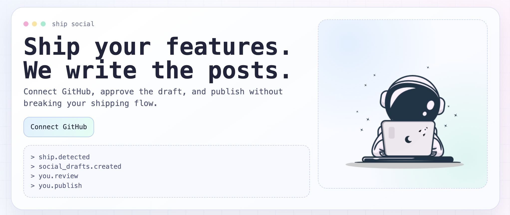

# Ship Social

<!-- image from public -->



## Demo


[▶ Watch demo video](public/demo/demo.mp4)

Turn GitHub release signals into social-ready drafts for indie hackers.

Core loop: **Ship feature -> check inbox -> approve draft -> publish**

## What This App Does

- Authenticates users with a GitHub access token from environment config.
- Lets users connect repositories in Repo Manager.
- Generates social post drafts from shipping signals (release -> merged PR fallback).
- Produces multiple draft variants and a generated visual.
- Provides a draft workspace with X preview (default), edit/save/copy/approve actions.
- Supports tone profiles (preset + custom + extraction helper).
- Stores data in Postgres only, with embedded Postgres quickstart support.

## Quick Tech Stack

- **Framework:** Next.js 15 + React 19
- **Runtime:** Node.js (>= 20)
- **Styling:** Raw CSS (`app/globals.css`)
- **AI:** Vercel AI SDK + OpenAI / AI Gateway model routing
- **Database:** Postgres (`pg`) with optional embedded Postgres (`embedded-postgres`)
- **Migrations:** SQL files in `migrations/*.sql`
- **CLI:** `bin/ship-social.js` (`quickstart`)

## Setup

### 1) Create a GitHub Access Token

Create a GitHub personal access token for local usage:

- Create classic token: [https://github.com/settings/tokens](https://github.com/settings/tokens)

If using fine-grained, repo-scoped, ensure:

- `repo`
- `read:user`

### 2) Run Quickstart (Recommended)

Published package flow:

```bash
mkdir ship-social
cd ship-social
npx ship-social@latest quickstart
```

Run this in a dedicated local folder (not inside an unrelated repo). Quickstart creates runtime files under `.ship-social-runtime` in your current directory.

Or from this repository:

```bash
npm install
npm run quickstart
```

Quickstart will:

- Prompt for `GITHUB_ACCESS_TOKEN`
- Prompt for one AI key (`AI_GATEWAY_API_KEY` recommended, or `OPENAI_API_KEY`)
- Write/update `.env` safely (no silent overwrite)
- Start embedded Postgres and set `DATABASE_URL`
- Apply migrations from `migrations/*.sql`
- Start the app (`npm run dev`)

Then open [http://localhost:3000](http://localhost:3000).

### 3) Optional: External Postgres Instead of Embedded

If `.env` already has a non-quickstart-managed `DATABASE_URL`, quickstart treats it as external Postgres and skips embedded DB startup.

Manual run path:

```bash
npm install
npm run db:migrate
npm run dev
```

### 4) Environment Variables

Start from:

```bash
cp .env.example .env
```

Core variables:

- `APP_URL=http://localhost:3000`
- `GITHUB_ACCESS_TOKEN=...`
- `AI_GATEWAY_API_KEY=...` (recommended)
- `OPENAI_API_KEY=...` (optional fallback)
- `AI_TEXT_MODEL=openai/o4-mini`
- `AI_IMAGE_MODEL=google/gemini-2.5-flash-image` (gateway-only)
- `OPENAI_IMAGE_MODEL=gpt-image-1` (used when gateway is not configured)

Key generation links:

- GitHub access token: [GitHub Tokens](https://github.com/settings/tokens)
- OpenAI key: [OpenAI API Keys](https://platform.openai.com/api-keys)
- AI Gateway key: [Vercel AI Gateway docs](https://vercel.com/docs/ai-gateway)

Optional:

- `AI_IMAGE_MODEL=google/gemini-3.1-flash-image-preview`
- `DATABASE_URL=postgresql://...`

## Release Signal Behavior (Manual Trigger)

Manual trigger resolves in this order:

1. Latest published **GitHub release** (`/releases/latest`)
2. Fallback: latest **merged PR** into default branch

For merged PR signal, the app fetches extra context:

- PR metadata (number, branches, additions/deletions, changed files, commits)
- Changed files (with patch previews)
- Commit messages

## AI + Model Behavior

| Condition                                                    | Text model source                      | Image model source                                      | Notes                                                                                 |
| ------------------------------------------------------------ | -------------------------------------- | ------------------------------------------------------- | ------------------------------------------------------------------------------------- |
| `AI_GATEWAY_API_KEY` (or `VERCEL_AI_GATEWAY_API_KEY`) is set | `AI_TEXT_MODEL` via AI Gateway         | `AI_IMAGE_MODEL` via AI Gateway                         | Supports gateway model IDs like `openai/o4-mini` and `google/gemini-2.5-flash-image`. |
| Gateway key is not set, `OPENAI_API_KEY` is set              | OpenAI fallback (from `AI_TEXT_MODEL`) | `OPENAI_IMAGE_MODEL` (default `gpt-image-1`) via OpenAI | `AI_IMAGE_MODEL` is ignored in this mode.                                             |
| No gateway key and no `OPENAI_API_KEY`                       | No AI generation                       | No AI generation                                        | App falls back to template-based content/image behavior.                              |

- Gemini image models on gateway use multimodal `generateText` file output flow.
- Draft composer shows:
  - `source: <model-id>` when generation succeeded
  - `source: Error` when generation failed and fallback path was used

## Tone Profile Features

- Built-in presets + custom tones
- AI extraction from pasted past posts:
  - Paste 3-5 examples
  - Click `Extract tone`
  - Review/edit generated name/description/rules
  - Save as custom tone

## Current Product Surface

- GitHub token-based login (env-configured token)
- GitHub repo discovery and connection
- Repo manager modal for onboarding/configuration
- Manual trigger per connected repo
- Draft + inbox creation from trigger
- Draft editor: save, copy, approve
- X-style preview
- Tone manager modal with extraction helper
- Draggable Inbox vs Draft workspace divider

## Data Persistence

Storage backend is selected like this:

- Postgres only
- `DATABASE_URL` is required at runtime
- `quickstart` auto-writes `DATABASE_URL` for embedded Postgres

Data locations:

- Embedded Postgres data dir: `data/embedded-postgres`
- SQL migrations used by runtime + quickstart: `migrations/*.sql`

## Troubleshooting

- `DATABASE_URL is required for postgres storage backend`
  - Set `DATABASE_URL` in `.env` or shell and rerun `npm run db:migrate`.
- `ECONNREFUSED` or cannot connect to Postgres
  - Verify host/port/credentials in `DATABASE_URL` and confirm server is running.
